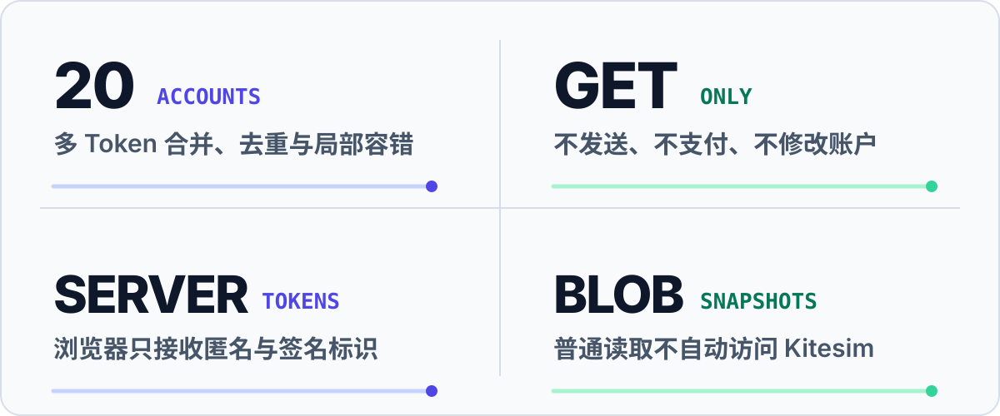
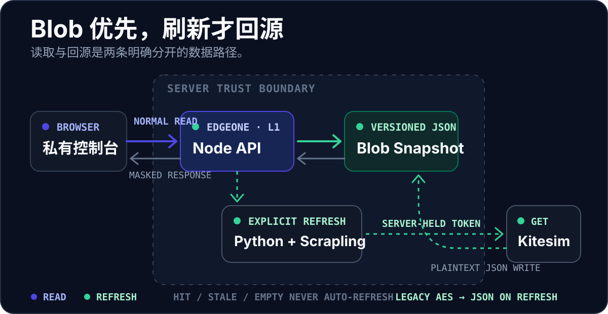

<p align="center">
  
</p>

<p align="center">
  <a href="#核心能力">核心能力</a> ·
  <a href="#架构">架构</a> ·
  <a href="#快速开始">快速开始</a> ·
  <a href="#部署到-edgeone">EdgeOne 部署</a> ·
  <a href="#安全模型">安全模型</a>
</p>

<p align="center">
  <code>React 19 + TypeScript</code> · <code>Python 3.10 + Scrapling</code> · <code>EdgeOne Blob</code>
</p>

<p align="center">
  <a href="https://edgeone.ai/pages/new?repository-url=https%3A%2F%2Fgithub.com%2Fopxqo%2Fkitesim-scrapling-client&project-name=kitesim-relay&root-directory=.%2F&install-command=npm%20ci&build-command=npm%20run%20build&output-directory=.%2Fdist&env=KITESIM_TOKEN_1%2CKITESIM_TOKEN_NAME_1%2CDASHBOARD_ACCESS_KEY%2CSMS_CACHE_TTL_SECONDS&env-description=Configure%20these%20server-side%20values%20before%20the%20first%20deployment">
    
  </a>
</p>

<p align="center"><sub>一键部署会预填仓库与构建配置；首次上线前仍需设置服务端密钥。</sub></p>

Kitesim Relay 面向需要集中管理多个 Kitesim Token 的个人与小团队。它把号码状态、短信和 OTP 聚合到一张私有工作台，同时把上游访问与浏览器隔离开。

## 核心能力

<p align="center">
  
</p>

项目的边界故意保持很窄：只聚合读取，不提供创建订单、发送短信、支付、退款或账户修改能力。单个账户失败时，其余账户仍可继续返回。

## 架构

<p align="center">
  
</p>

- **普通读取**：浏览器 → EdgeOne Node API → Blob 快照。`hit`、`stale`、`empty` 都不会自动访问 Kitesim。
- **显式刷新**：手动刷新或用户主动开启的定时刷新 → Python Origin → Scrapling `Fetcher.get` → Kitesim → 回写 Blob。

浏览器只接收匿名 `accountId`、账户名称与服务端签名的 `messageHandle`；Kitesim Token 始终留在服务端。

## 快速开始

需要 Python 3.10 与 Node.js。

```bash
python3.10 -m venv .venv
source .venv/bin/activate
python -m pip install -U pip
python -m pip install -r requirements-web.txt
npm ci

export KITESIM_TOKEN_1='YOUR_KITESIM_TOKEN'
export KITESIM_TOKEN_NAME_1='主号码'
export DASHBOARD_ACCESS_KEY="$(python -c 'import secrets; print(secrets.token_urlsafe(32))')"
```

分别启动 API 与前端：

```bash
# 终端 1
source .venv/bin/activate
python app.py
```

```bash
# 终端 2
npm run dev
```

打开 <http://127.0.0.1:5173>，输入 `DASHBOARD_ACCESS_KEY`。不要在网页中填写 Kitesim Token。

> [!NOTE]
> 本地 Flask + Vite 模式直接访问 Python API，适合调试上游接口，但不模拟 EdgeOne Blob 优先路径。完整缓存链请使用 `edgeone makers dev` 或 Preview 环境验证。

## 部署到 EdgeOne

点击页面顶部的 **Deploy to EdgeOne**，然后在项目设置中配置以下服务端变量：

| 变量 | 要求 | 用途 |
| --- | --- | --- |
| `KITESIM_TOKEN_1` | 必填 | 第一个 Kitesim 账户 Token |
| `KITESIM_TOKEN_NAME_1` | 可选 | 账户显示名称 |
| `DASHBOARD_ACCESS_KEY` | 必填 | 控制台口令，至少 12 个字符 |
| `SMS_CACHE_TTL_SECONDS` | 可选 | 快照新鲜度，默认 20 秒，范围 5–300 秒 |

多账户继续添加 `KITESIM_TOKEN_2` … `KITESIM_TOKEN_20`，并按需添加对应的 `KITESIM_TOKEN_NAME_2` … `KITESIM_TOKEN_NAME_20`。

<details>
<summary><strong>使用 EdgeOne CLI 部署与验证</strong></summary>

Global 与 China 项目相互隔离，部署前先确认当前账号与项目：

```bash
edgeone -v
edgeone whoami
edgeone makers link
edgeone makers env set KITESIM_TOKEN_1 "$KITESIM_TOKEN_1"
edgeone makers env set KITESIM_TOKEN_NAME_1 "$KITESIM_TOKEN_NAME_1"
edgeone makers env set DASHBOARD_ACCESS_KEY "$DASHBOARD_ACCESS_KEY"
edgeone makers env set KITESIM_REQUEST_TIMEOUT '12'
edgeone makers env set SMS_CACHE_TTL_SECONDS '20'
edgeone makers deploy -e preview
```

`edgeone.json` 已声明 `npm ci`、`npm run build`、`dist`、Node.js 22.11.0 与 60 秒 Python 函数超时。

Preview 至少检查首页、构建后的静态资源、`/api/health`、`/api/session`、`/api/orders`、`/api/messages`，以及 `Content-Security-Policy`、`X-Frame-Options`、`X-Content-Type-Options`、`Cache-Control` 与 `X-SMS-Cache`。Preview 验证完成前不要发布到 Production。

</details>

## 安全模型

- **只读上游**：Kitesim 客户端只使用静态 `Fetcher.get`。
- **服务端身份**：Token 不进入浏览器；`messageHandle` 将账户、订单与号码绑定，不能跨账户复用。
- **默认遮罩**：验证码与短信中的长数字默认隐藏，完整内容必须由用户显式请求。
- **私有会话**：控制台口令只保存在当前标签页的 `sessionStorage`，关闭标签页后清除。
- **Blob 优先**：普通读取只访问快照；过期或缺失都不会静默回源。

> [!IMPORTANT]
> 不要把真实 Token 或控制台口令写入代码、README、日志与截图。任何已经暴露的 Token 都应立即在 Kitesim 侧刷新。Blob 快照包含敏感数据，必须限制项目与存储访问权限。

<details>
<summary><strong>完整配置参考</strong></summary>

| 变量 | 用途 |
| --- | --- |
| `KITESIM_TOKEN_1` … `KITESIM_TOKEN_20` | 推荐的多账户配置，每个变量一个 Token |
| `KITESIM_TOKEN_NAME_1` … `KITESIM_TOKEN_NAME_20` | 对应的可选账户名称 |
| `KITESIM_TOKENS` | 本地简写：JSON 或逗号、分号、换行分隔；不超过 500 字节 |
| `KITESIM_TOKEN` | 单账户兼容模式，也是 CLI 使用的变量 |
| `DASHBOARD_ACCESS_KEY` | 控制台访问口令，至少 12 个字符 |
| `KITESIM_REQUEST_TIMEOUT` | 上游请求超时，默认 12 秒 |
| `SMS_CACHE_ENCRYPTION_KEY` | 可选；仅用于读取旧版 AES-256-GCM 快照 |
| `SMS_CACHE_TTL_SECONDS` | 快照新鲜度，默认 20 秒，范围 5–300 秒 |

本地少量账户也可以使用：

```bash
export KITESIM_TOKENS='[{"name":"主号码","token":"TOKEN_1"},{"name":"备用号码","token":"TOKEN_2"}]'
```

所有 Token 来源会合并并去重，最多接受 20 个账户。EdgeOne 当前将单个环境变量值限制为 500 字节，因此部署时优先使用编号变量；具体限制以 [EdgeOne Makers Limits and Quotas](https://pages.edgeone.ai/document/limits-and-quotas) 为准。

</details>

<details>
<summary><strong>CLI 与开发验证</strong></summary>

命令行客户端使用单个 `KITESIM_TOKEN`：

```bash
python kitesim_scrapling.py
python kitesim_scrapling.py --all-status
python kitesim_scrapling.py --show-code --show-sms
python kitesim_scrapling.py --json
```

完整检查：

```bash
npm run typecheck
npm run lint
npm test
npm run build
.venv/bin/python -m unittest discover -s tests -v
.venv/bin/python -m py_compile app.py kitesim_scrapling.py cloud-functions/origin/index.py cloud-functions/_shared/*.py
```

测试只使用假 Token、假号码与假短信，不访问真实 Kitesim。

</details>

<details>
<summary><strong>项目结构</strong></summary>

```text
src/                              React 控制台、数据控制器与 UI 组件
assets/readme/                    README 纯 SVG 视觉资产
cloud-functions/api/             EdgeOne Node API 与 Blob 路由
cloud-functions/origin/          EdgeOne Python Origin
cloud-functions/_shared/         账户签名、缓存、API 与 Kitesim 客户端
app.py                            本地 Flask API 与 dist 预览服务
kitesim_scrapling.py             单账户命令行客户端
edgeone.json                      构建、安全响应头与函数配置
```

</details>

<details>
<summary><strong>已知边界</strong></summary>

- Blob TTL 只区分 `hit` 与 `stale`；旧快照不会自动删除，也不会触发自动刷新。
- 定时刷新默认关闭，可由用户选择 30 秒、1 分钟或 5 分钟。
- 单次最多返回 20 个号码；每个号码最多返回 20 条短信。
- 默认状态最多并发读取 8 个账户；“全部状态”最多查询 8 个账户，并对每个账户读取 5 种状态。
- Python Origin 固定挂载在 `/origin/*`，避免覆盖 Node Blob API。
- 项目只支持 Scrapling 0.4.12 的静态 `Fetcher`，不支持 `DynamicFetcher` 或 `StealthyFetcher`。
- Blob 快照不会自动删除，长期不再使用的对象需要手动清理。

</details>
