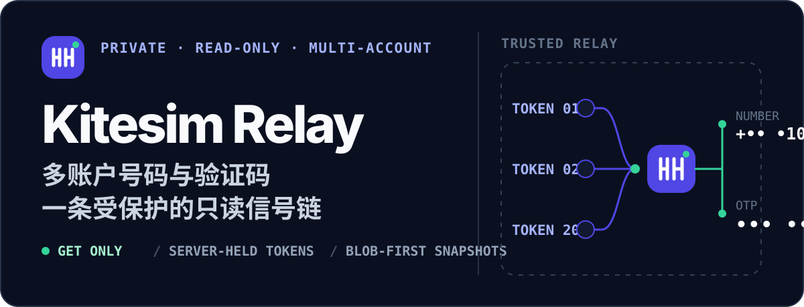

<p align="center">
  
</p>

<p align="center">
  <code>React 19 + TypeScript</code> · <code>EdgeOne Functions</code> · <code>Python 3.10 + Scrapling</code> · <code>EdgeOne Blob</code>
</p>

<p align="center">
  <a href="https://edgeone.ai/pages/new?repository-url=https%3A%2F%2Fgithub.com%2Fopxqo%2Fkitesim-scrapling-client&project-name=kitesim-relay&root-directory=.%2F&install-command=npm%20ci&build-command=npm%20run%20build&output-directory=.%2Fdist&env=KITESIM_LOGIN_EMAIL_1%2CKITESIM_LOGIN_EMAIL_2%2CKITESIM_LOGIN_EMAIL_3%2CKITESIM_LOGIN_PASSWORD%2CKITESIM_AUTH_ENCRYPTION_KEY%2CKITESIM_AUTH_BRIDGE_SECRET%2CKITESIM_AUTH_AUTOMATION_ENABLED%2CKITESIM_AI_API_KEY%2CDASHBOARD_ACCESS_KEY%2CSMS_CACHE_TTL_SECONDS&env-description=Configure%20server-side%20login%20credentials%2C%20AI%20gateway%2C%20and%20independent%20secrets%20before%20deployment">
    
  </a>
</p>

Kitesim Relay 将多个 Kitesim 账户的号码、短信和 OTP 汇聚到一张私有工作台。项目只提供读取能力，不创建订单、不发送短信，也不执行支付、退款或账户修改。

## 工作方式

- **自动登录**：Token 缺失或验证失效时，服务端把验证码图片单独交给 OpenAI 兼容视觉模型识别，再完成登录和账户归属校验。
- **凭据保存**：登录产生的 Token 按账户使用 AES-256-GCM 加密，分别写入私有 `kitesim-auth` Blob；密码不写入 Blob，浏览器也不会收到密码或 Token。
- **普通读取**：浏览器只读取号码和短信 Blob 快照。快照为 `hit`、`stale` 或 `empty` 时都不会静默访问 Kitesim。
- **Token 维护**：EdgeOne 每天 03:17（Asia/Shanghai）执行一次健康检查；显式刷新也会执行受冷却保护的检查，然后用 120 秒有效的 HMAC 签名包调用 Python Origin。
- **局部容错**：一个账户失效时，其余已登录账户仍可返回；后台会标明需要重新验证的账户。

模型只接收验证码图片与固定识别指令，不接收邮箱、密码、Token 或内部签名密钥。模型输出必须是严格的 4 位字母数字；自动流程最多尝试 3 次，每次都会获取新验证码。AI 失败时仍可由管理员人工输入验证码接管。

## 本地运行

需要 Node.js 22、Python 3.10 和 EdgeOne CLI。

```bash
npm ci
python3.10 -m venv .venv
source .venv/bin/activate
python -m pip install -r cloud-functions/requirements.txt
cp .env.example .env
```

编辑被 Git 忽略的 `.env`，至少填写登录邮箱、共享密码以及三个独立安全值。

可用隐藏输入脚本写入 AI 网关密钥；脚本不会回显密钥，也不会把它放进命令历史：

```bash
npm run configure:ai
```

然后运行完整的 EdgeOne 本地环境：

```bash
edgeone makers dev
```

打开 CLI 输出的本地地址，粘贴 `DASHBOARD_ACCESS_KEY` 解锁。进入“账户登录”后点击“立即维护”，AI 会为缺失 Token 的账户自动完成验证码登录；失败的账户可使用人工验证码按钮接管。完成后点击工作台刷新按钮生成号码/短信快照。

若从旧静态 Token 配置迁移，可运行仓库内脚本。它会删除旧 Token 变量、保留现有账户密码、生成独立控制台口令，并保证 `.env` 权限为 `600`：

```bash
node scripts/configure-local-accounts.mjs first@example.com second@example.com third@example.com
```

脚本不会输出密码、Token 或生成的密钥。

## 环境变量

| 变量 | 要求 | 用途 |
| --- | --- | --- |
| `KITESIM_LOGIN_EMAIL_1` … `KITESIM_LOGIN_EMAIL_20` | 至少 1 个 | 分账户登录邮箱；编号可以不连续 |
| `KITESIM_LOGIN_PASSWORD` | 必填 | 所有已配置账户共用的 Kitesim 密码 |
| `KITESIM_AUTH_ENCRYPTION_KEY` | 必填 | Base64 编码的 32 字节 AES 密钥，用于加密账户 Token Blob |
| `KITESIM_AUTH_BRIDGE_SECRET` | 必填 | 至少 24 字符，签名 Node → Python 的短时多账户载荷 |
| `KITESIM_AUTH_AUTOMATION_ENABLED` | AI 自动维护必填 | 设为 `true` 才允许计划任务、显式刷新和控制台触发自动维护 |
| `KITESIM_AI_BASE_URL` | 可选 | OpenAI 兼容 API 根地址；默认 `https://ai.opxqo.com/compat/v1` |
| `KITESIM_AI_API_KEY` | AI 自动维护必填 | 服务端 AI 网关密钥，不得暴露到 `VITE_*` 或仓库 |
| `KITESIM_AI_MODEL` | 可选 | 默认 `google-ai-studio/gemini-3.1-flash-lite-preview` |
| `KITESIM_AUTH_MAX_CAPTCHA_ATTEMPTS` | 可选 | 每个账户每轮最多 1–3 次，默认 3 |
| `KITESIM_AUTH_MAINTENANCE_INTERVAL_HOURS` | 可选 | 成功维护后的冷却时间，6–168 小时，默认 20 |
| `KITESIM_AI_TIMEOUT_SECONDS` | 可选 | 单次模型请求超时，5–20 秒，默认 12 |
| `DASHBOARD_ACCESS_KEY` | 必填 | 独立控制台口令，至少 12 个字符；不要复用 Kitesim 密码 |
| `KITESIM_REQUEST_TIMEOUT` | 可选 | 上游单次请求超时，默认 12 秒 |
| `SMS_CACHE_TTL_SECONDS` | 可选 | 快照新鲜度，默认 20 秒，范围 5–300 秒 |
| `SMS_CACHE_ENCRYPTION_KEY` | 旧版迁移可选 | 仅读取旧 AES 快照；新部署应留空 |

自定义网关只读取 `KITESIM_AI_*`。不要改用 `AI_GATEWAY_*`：EdgeOne CLI 可能自动填入平台自带网关地址和配套密钥，它们不能与 `ai.opxqo.com` 混用。

生成独立密钥：

```bash
openssl rand -base64 32  # KITESIM_AUTH_ENCRYPTION_KEY
openssl rand -hex 32     # KITESIM_AUTH_BRIDGE_SECRET
openssl rand -base64 32  # DASHBOARD_ACCESS_KEY
```

本项目不支持任何静态 Kitesim Token 环境变量。运行时 Token 只能由验证码登录生成，并从加密 Blob 通过短时签名桥进入 Python Origin。

## 部署到 EdgeOne

本仓库已通过 `edgeone.json` 声明构建命令、`dist` 输出、Node.js 版本、安全响应头与 Python 函数超时。用户可在 EdgeOne 控制台手动部署，并设置与本地相同的变量名。

使用 CLI 时，先确认账号和项目，再逐项设置变量；不要把真实值写进命令历史共享记录或仓库：

```bash
edgeone -v
edgeone whoami
edgeone makers link
edgeone makers env set KITESIM_LOGIN_EMAIL_1 "$KITESIM_LOGIN_EMAIL_1"
edgeone makers env set KITESIM_LOGIN_PASSWORD "$KITESIM_LOGIN_PASSWORD"
edgeone makers env set KITESIM_AUTH_ENCRYPTION_KEY "$KITESIM_AUTH_ENCRYPTION_KEY"
edgeone makers env set KITESIM_AUTH_BRIDGE_SECRET "$KITESIM_AUTH_BRIDGE_SECRET"
edgeone makers env set KITESIM_AUTH_AUTOMATION_ENABLED 'true'
edgeone makers env set KITESIM_AI_BASE_URL 'https://ai.opxqo.com/compat/v1'
edgeone makers env set KITESIM_AI_API_KEY "$KITESIM_AI_API_KEY"
edgeone makers env set KITESIM_AI_MODEL 'google-ai-studio/gemini-3.1-flash-lite-preview'
edgeone makers env set DASHBOARD_ACCESS_KEY "$DASHBOARD_ACCESS_KEY"
edgeone makers env set SMS_CACHE_TTL_SECONDS '20'
edgeone makers deploy -e preview
```

为其余账户重复设置编号邮箱。环境变量修改后需要重新部署；验证码登录产生的加密 Token 保存在 Blob，不应放回环境变量。

## 安全边界

- Kitesim 上游业务客户端只发起只读 GET；登录端点仅用于交换短时 Token。
- 浏览器只接收脱敏邮箱提示、稳定 `accountId` 和服务端签名的 `messageHandle`。
- 每个 Token 使用账户专属 Blob 路径和 AES-GCM AAD；修改对应邮箱后旧密文会自动失效。
- Python Origin 不读取静态 Token 配置；缺少、伪造或过期的内部多账户签名包会在访问上游前被拒绝。
- 控制台口令只保存在当前标签页的 `sessionStorage`，关闭标签页后清除。
- AI 请求体只包含固定提示词和验证码图片；网关密钥仅从服务端环境变量读取，错误响应不会写入日志或 Blob。
- 计划任务入口不返回 Token，并使用 Blob 冷却记录限制重复执行；控制台带访问口令时可显式强制检查。
- 号码、短信和验证码快照是私有 Blob 中的版本化 JSON，必须限制 EdgeOne 项目和存储访问权限。

## 验证

```bash
npm run typecheck
npm run lint
npm test
npm run build
.venv/bin/python -m unittest discover -s tests -v
.venv/bin/python -m py_compile app.py kitesim_scrapling.py cloud-functions/origin/index.py cloud-functions/_shared/*.py
```

测试只使用假账户、假 Token、假号码和假短信，不访问真实 Kitesim。

## 已知边界

- 自动登录依赖 Kitesim 当前 H5 登录、图片验证码接口及所选视觉模型；接口字段、验证码样式或风控变化时需要同步适配。
- 登录成功只更新账户 Token，不立即刷新业务数据。
- 定时刷新默认关闭，可选 30 秒、1 分钟或 5 分钟。
- “全部状态”最多同时查询 8 个账户；普通状态最多并发读取 8 个账户。
- Blob 快照不会自动删除，长期废弃对象需要在存储侧手动清理。
