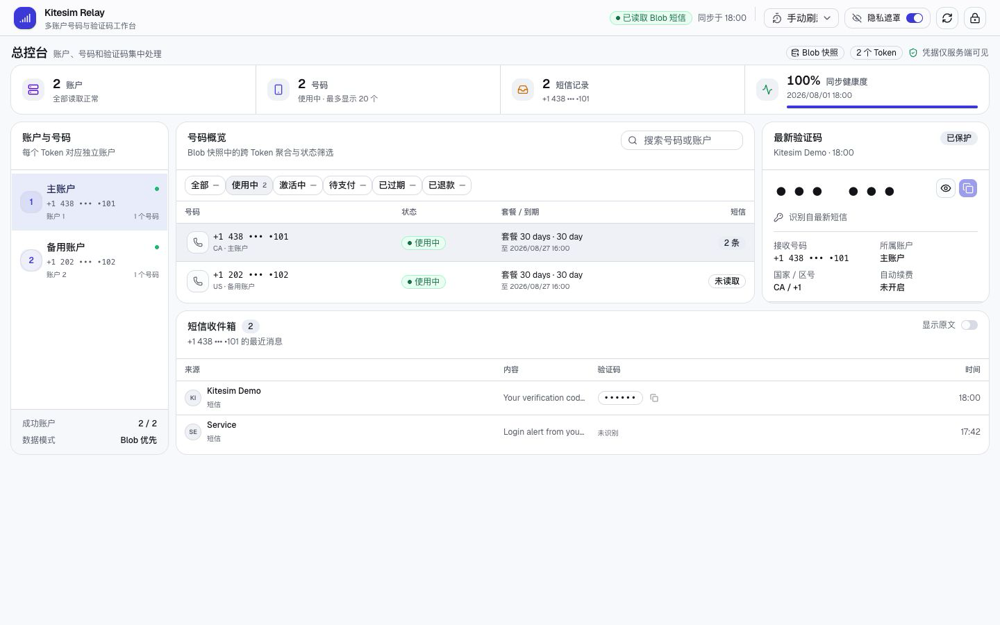
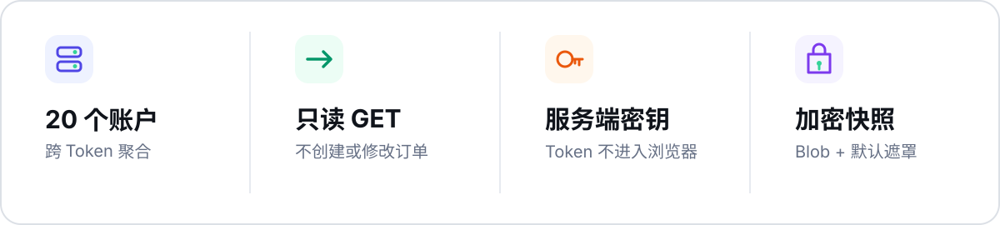
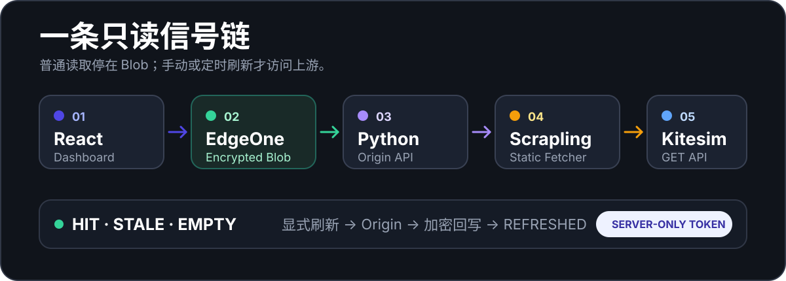

<p align="center">
  
</p>

<p align="center">
  <code>React 19</code> · <code>Scrapling 0.4.12</code> · <code>EdgeOne</code> · <code>shadcn/ui</code>
</p>

<p align="center">
  <strong>把多个 Kitesim 账户的号码、短信与验证码，收进一张私有工作台。</strong><br>
  <sub>上游只使用 GET；不发送短信、不创建订单、不支付、不退款、不修改账户。</sub>
</p>

<p align="center">
  
</p>

<p align="center"><sub>本地脱敏演示 · 全部由假 Token、假号码和假短信生成</sub></p>

<p align="center">
  
</p>

## 数据怎么走

<p align="center">
  
</p>

Token 始终留在服务端。浏览器只接收匿名 `accountId`、账户名称和服务端签名的 `messageHandle`；普通读取只看 Blob 快照，只有手动或用户启用的定时刷新才回源 Kitesim。

## 快速开始

需要 Python 3.10 与 Node.js。

```bash
python3.10 -m venv .venv
source .venv/bin/activate
python -m pip install -U pip
python -m pip install -r requirements-web.txt
npm ci

export KITESIM_TOKEN_1='YOUR_KITESIM_TOKEN'
export KITESIM_TOKEN_NAME_1='主号码'
export DASHBOARD_ACCESS_KEY="$(python -c 'import secrets; print(secrets.token_urlsafe(32))')"
```

分别启动 API 与前端：

```bash
# 终端 1
source .venv/bin/activate
python app.py
```

```bash
# 终端 2
npm run dev
```

打开 <http://127.0.0.1:5173>，输入 `DASHBOARD_ACCESS_KEY`。不要在网页里填写 Kitesim Token。

## 配置一览

| 变量 | 用途 |
| --- | --- |
| `KITESIM_TOKEN_1` … `KITESIM_TOKEN_20` | 推荐的多账户配置，每个变量一个 Token |
| `KITESIM_TOKEN_NAME_1` … `KITESIM_TOKEN_NAME_20` | 对应的可选账户名称 |
| `KITESIM_TOKENS` | 本地简写：JSON 或逗号、分号、换行分隔；不超过 500 字节 |
| `KITESIM_TOKEN` | 单账户兼容模式，也是 CLI 当前使用的变量 |
| `DASHBOARD_ACCESS_KEY` | 控制台访问口令，至少 12 个字符 |
| `KITESIM_REQUEST_TIMEOUT` | 上游请求超时，默认 12 秒 |
| `SMS_CACHE_ENCRYPTION_KEY` | EdgeOne 号码与短信快照的 32 字节 Base64 AES-256-GCM 密钥 |
| `SMS_CACHE_TTL_SECONDS` | 快照新鲜度阈值，默认 20 秒，允许 5–300 秒 |

<details>
<summary><strong>多账户与安全规则</strong></summary>

EdgeOne 当前将单个环境变量值限制为 500 字节，因此多账户应拆成编号变量。具体限制以 [EdgeOne Makers Limits and Quotas](https://pages.edgeone.ai/document/limits-and-quotas) 为准。

本地少量账户可使用单行 JSON：

```bash
export KITESIM_TOKENS='[{"name":"主号码","token":"TOKEN_1"},{"name":"备用号码","token":"TOKEN_2"}]'
```

也支持简写：

```bash
export KITESIM_TOKENS='TOKEN_1,TOKEN_2,TOKEN_3'
```

- 所有 Token 来源会合并、去重，最多接受 20 个账户。
- `messageHandle` 将账户、订单与号码绑定，不能还原 Token，也不能跨账户复用。
- 单个账户失败时，接口继续返回其他健康账户并展示局部失败提醒。
- 真实 Token、控制台口令和缓存密钥不得写入代码、`.env.example`、README、日志或截图。
- 已经出现在聊天、日志或截图里的 Token 应立即在 Kitesim 侧刷新。

</details>

<details>
<summary><strong>EdgeOne Blob 与 Preview 部署</strong></summary>

普通 Vite + Flask 模式直接调用 Python `/api/orders` 与 `/api/messages`，适合调试上游接口，但不模拟 Blob 优先路径。要验证 Node 缓存路由、Blob 命名空间和缓存响应头，请使用已关联项目的 EdgeOne 本地运行时：

```bash
export SMS_CACHE_ENCRYPTION_KEY="$(openssl rand -base64 32)"
export SMS_CACHE_TTL_SECONDS='20'
edgeone makers dev
```

部署前先确认 Global 或 China 项目；两套账号与项目相互隔离：

```bash
edgeone -v
edgeone whoami
edgeone makers link
edgeone makers env set KITESIM_TOKEN_1 "$KITESIM_TOKEN_1"
edgeone makers env set KITESIM_TOKEN_NAME_1 "$KITESIM_TOKEN_NAME_1"
edgeone makers env set DASHBOARD_ACCESS_KEY "$DASHBOARD_ACCESS_KEY"
edgeone makers env set KITESIM_REQUEST_TIMEOUT '12'
edgeone makers env set SMS_CACHE_ENCRYPTION_KEY "$SMS_CACHE_ENCRYPTION_KEY"
edgeone makers env set SMS_CACHE_TTL_SECONDS '20'
edgeone makers deploy -e preview
```

多账户时按相同方式继续设置编号变量。`edgeone.json` 已声明：

```text
根目录      ./
安装命令    npm ci
构建命令    npm run build
输出目录    dist
Node.js     22.11.0
Python 超时 60 秒
```

Preview 至少检查：

```text
GET  /
GET  /assets/<构建后的 CSS 文件名>
GET  /api/health
POST /api/session
GET  /api/orders?status=2
POST /api/messages
```

缓存状态：

- `empty`：没有快照，不自动访问 Python Origin 或 Kitesim。
- `hit`：返回新鲜快照。
- `stale`：立即返回旧快照，仍不自动回源。
- `refreshed`：显式刷新成功并已加密回写 Blob。
- `bypass`：显式刷新成功，但 Blob 未配置或写入失败。

同时检查 `Content-Security-Policy`、`X-Frame-Options`、`X-Content-Type-Options`、`Cache-Control` 与 `X-SMS-Cache`。当前 EdgeOne CLI 的本地静态服务不完整模拟 CDN 响应头，这一项必须以 Preview HTTPS 响应为准。Preview 验证通过前不要发布到 Production，也不要绑定正式域名。

</details>

<details>
<summary><strong>生产包、CLI 与测试</strong></summary>

验证生产静态包：

```bash
npm run build
export KITESIM_WEB_PORT=8088
.venv/bin/python app.py
```

命令行客户端仍使用单个 `KITESIM_TOKEN`：

```bash
python kitesim_scrapling.py
python kitesim_scrapling.py --all-status
python kitesim_scrapling.py --show-code --show-sms
python kitesim_scrapling.py --json
```

默认只取“使用中”的最新号码，并遮罩验证码与短信中的长数字。

完整检查：

```bash
npm run typecheck
npm run lint
npm test
npm run build
.venv/bin/python -m unittest discover -s tests -v
.venv/bin/python -m py_compile app.py kitesim_scrapling.py cloud-functions/api/index.py cloud-functions/_shared/*.py
```

测试只使用假 Token、假号码与假短信，不访问真实 Kitesim。

</details>

<details>
<summary><strong>项目结构</strong></summary>

```text
src/                               React 控制台、数据控制器与 shadcn/ui
public/favicon.svg                 项目 Logo
assets/readme/                     README 视觉素材
cloud-functions/api/orders.js     EdgeOne Blob 号码入口
cloud-functions/api/messages.js   EdgeOne Blob 短信入口
cloud-functions/api/index.py      EdgeOne Python Origin
cloud-functions/_shared/           共享 API、账户签名与 Scrapling 客户端
app.py                             本地 Flask API 与 dist 预览服务
kitesim_scrapling.py              单账户命令行客户端
edgeone.json                       构建、安全头与函数超时
```

</details>

<details>
<summary><strong>已知边界</strong></summary>

- 控制台口令保存在当前标签页的 `sessionStorage`，关闭标签页后清除。
- 定时刷新保存在 `localStorage`，默认关闭；可选 30 秒、1 分钟或 5 分钟。
- Blob 没有对象 TTL。`SMS_CACHE_TTL_SECONDS` 只区分 `hit` 与 `stale`；旧快照不自动删除，也不触发自动刷新。
- 轮换 `SMS_CACHE_ENCRYPTION_KEY` 后旧快照无法解密，普通读取返回 `empty`，下一次显式刷新才使用新密钥回写。
- 默认状态最多并发读取 8 个账户；“全部状态”最多查询 8 个账户，并对每个账户发起 5 次读取。
- 单次返回最多 20 个号码；每个号码最多返回 20 条短信。
- 多账户短信请求必须携带订单响应中的匿名 `accountId` 与签名 `messageHandle`。
- Kitesim 列表筛选码与订单 `orderStatus` 的顺序不同，映射由 `ORDER_FILTER_TO_UPSTREAM_STATUS` 维护。
- Scrapling 0.4.12 仅使用静态 `Fetcher`；项目不支持 `DynamicFetcher` 或 `StealthyFetcher`。
- Blob 长期不再访问的加密对象需要手动清理。

</details>
